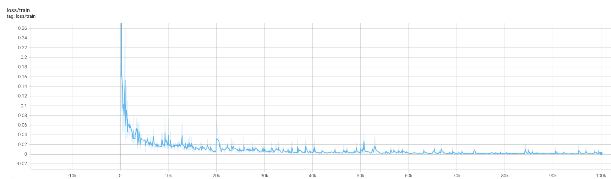

# Video Diffusion Model (JAX/Flax NNX)

This project implements a video diffusion model using JAX and the Flax NNX library. It allows for training a model to generate video sequences based on the principles of denoising diffusion probabilistic models.
The code is adopted from https://github.com/lucidrains/video-diffusion-pytorch, which implements a video diffusion model in Pytorch.

## Setup

Ensure you have the necessary dependencies installed (e.g., `jax`, `flax`, `optax`, `orbax-checkpoint`, `torch`, `torchvision`, `einops`, `PyYAML`). You might use a `requirements.txt` or manage dependencies manually.

```bash
# Example dependency installation (adjust as needed)
pip install -r requirements.txt
```

## Training

Training is configured via a YAML file (default: `configs/config.yaml`). Modify this file to set hyperparameters, dataset paths, model dimensions, etc.

To start training, run:

```bash
python train.py --config path/to/your/config.yaml [--rng_seed <seed_value>]
```

*   Replace `path/to/your/config.yaml` with the actual path to your configuration file if it's not the default.
*   Add `--rng_seed <seed_value>` (optional) to control the random number generation for training reproducibility.
*   Checkpoints (including model and EMA parameters) will be saved according to the settings in the config file (e.g., `checkpoint_dir_path`, `checkpoint_every_steps`, `max_to_keep`).
*   To resume training from a specific step, you can use --resume_step <step_numerb>:
```bash
python train.py --config path/to/config.yaml --resume_step <step_number>
```

## Sample Results

Below are some example generated sequences from the V2.2 config after 100000 steps of training:

<table>
  <tr>
    <td></td>
    <td></td>
    <td></td>
    <td></td>
  </tr>
  <tr>
    <td></td>
    <td></td>
    <td></td>
    <td></td>
  </tr>
</table>

The training curve of the above samples is below:



## Sampling

To generate video samples from a trained checkpoint:

```bash
python sample.py --checkpoint-path /path/to/checkpoint/dir --step <step_number> --output-path /path/to/save/output --config /path/to/config.yaml [--seed <seed_value>] [--load-ema-params]
```

**Arguments:**

*   `--checkpoint-path`: Path to the **directory** containing the saved checkpoints (e.g., `./results/checkpoints`).
*   `--step`: The specific training step number of the checkpoint to load.
*   `--output-path`: The directory where the generated sample GIF(s) will be saved (e.g., `./samples`).
*   `--config`: Path to the YAML configuration file that matches the model architecture used for the checkpoint (usually the same one used for training).
*   `--seed <seed_value>` (optional, default 0): Set the random seed for sampling reproducibility.
*   `--load-ema-params` (optional): Load the Exponential Moving Average (EMA) parameters instead of the standard model parameters.

**Example:**

```bash
# Sample using default seed and standard parameters
python sample.py --checkpoint-path ./results/checkpoints --step 50000 --output-path ./generated_samples --config configs/config.yaml

# Sample using a specific seed and EMA parameters
python sample.py --checkpoint-path ./results/checkpoints --step 50000 --output-path ./generated_samples_ema --config configs/config.yaml --seed 42 --load-ema-params
```
